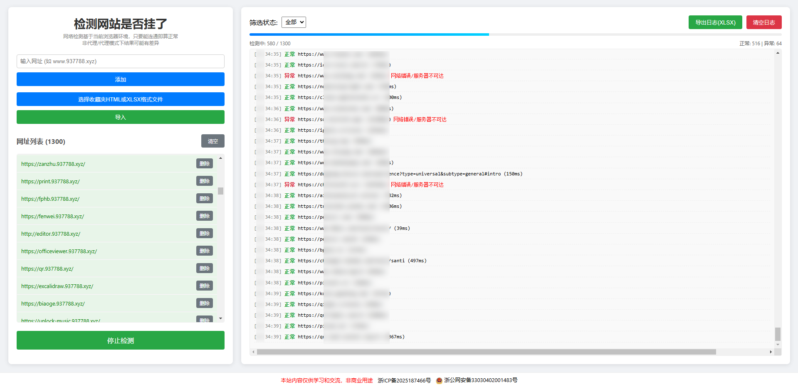

# 网站是否挂了检测工具

本仓库为一个纯前端的「监测网站是否挂了」小工具。用于在浏览器里快速检测一批网站是否可访问并记录结果，

适合本地使用、学习和演示；不包含后端服务。

演示地址：https://urltest.937788.xyz/

主要功能
- 可将浏览器导出的书签 HTML 或 XLSX 导入网址并自动加入检测列表。
- 单次并发检测（支持并发限制、停止操作）。
- 实时展示检测进度条。
- 根据筛选结果可导出全部日志/正常日志/异常日志，导出格式为XLSX格式。
- 可一键清空检测列表、一键清空日志列表。

使用方法
1. 在本地打开 `index.html`（双击或通过本地静态服务器）。
2. 在左侧输入框添加单个网址，或使用“导入收藏夹”选择浏览器导出的 bookmarks HTML 文件或 XLSX 文件批量导入。
3. 点击“开始监测”开始检测，检测过程中可点击“停止检测”中止当前未完成的请求。
4. 在右侧可查看日志并通过“导出日志”保存为 XLSX 文件。

注意事项
- 检测结果仅供参考，结果并非完全准确，请务必人工再次确认。
- 某些网站需要登录后才能访问，未登录状态下检测可能会报异常。
- 某些网站可能需要在代理模式下才能访问，若你是在非代理模式下检测，可能会报异常。
- 建议先导出在非代理模式下检测出异常部分的 XLSX 日志，然后开启代理模式，导入日志，再检测一次。

许可与用途
- 本项目仅供学习与交流，非商业用途。代码可自由阅读与修改，但请遵守相应法律与第三方服务使用条款。

## 测试截图

